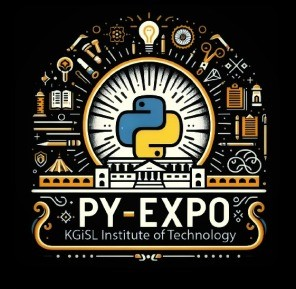

---

## Problem Statement

*Problem Statement ID – PYS116*

FOR STUDENTS
 ➢Struggle to keep up with fast-paced lectures.
 ➢Difficulty in revising lengthy lecture materials.
 ➢Lack of quick and efficient ways to clear doubts.
 ➢Limited access to structured quizzes for self-assessment.
FOR TEACHERS:
 ➢Time-consuming lecture note and quiz preparation.
 ➢Difficulty in manually creating quizzes and exams.
 ➢Lack of tools for tracking student engagement and progress

## Overview

PURPOSE AND OBJECTIVES:

This project aims to address challenges faced by both students and teachers in the learning process by providing an AI-powered platform that automates note-taking, quiz generation, and content summarization. The primary goals include:

Helping students keep up with fast-paced lectures and revise efficiently.
Providing quick and structured ways to clear doubts.
Enabling teachers to automate lecture note preparation and quiz creation.
Offering tools for tracking student engagement and progress.

PROPOSED SOLUTION:

An AI-driven web platform with the following key features:

Upload Notes & Lectures: Teachers can upload PDFs, documents, and lecture videos.
Smart Notes Generation: AI extracts key points and structures lecture content.
AI Q&A System: Students can ask questions within notes and get instant answers.
Auto-Generated Quizzes: AI creates MCQs, True/False, and essay-type questions.
Video Summarization: AI transcribes and highlights key takeaways from lectures.

---

## Team Members

*Team ID – T100*

List your team members along with their roles.

- *JERSHINA BLESSY P* - Team Leader
- *HARINI S* - Back-end
- *KISHORE JOTHISH N* - Front-end
- *SANTHOSINI M* - Paper work
- *MOHAMED FAIZAL A* - Front-end
- *DAMASVASREE N* - Back-end

---

## Technical Stack

- *Frontend:* HTML, CSS, JavaScript
- *Backend:* Flask, Gemini AI, Langchain, Faiss, Pypdf2, Pytesseract and Pdf2image, OpenAI Whisper 
- *Database:* MySQL

---

## Getting Started

Follow these steps to clone and run the application locally.

### Prerequisites

1. Install [Python](https://www.python.org/downloads/).
2. Install [Git](https://git-scm.com/).
3. Clone this repository:
   bash
   git clone https://github.com/username/repository-name.git
   

### Installation

1. Navigate to the project directory:
   bash
   cd repository-name
   
2. Create a virtual environment:
   bash
   python -m venv venv
   
3. Activate the virtual environment:
   - On Windows:
     bash
     venv\Scripts\activate
     
   - On macOS/Linux:
     bash
     source venv/bin/activate
     
4. Install dependencies:
   bash
   pip install -r requirements.txt
   
5. Navigate to source
   bash
   cd source
   

---

## Start the Application

1. Run the Flask application:
   bash
   flask run
   
2. Open your browser and navigate to:
   
   http://127.0.0.1:5000/
   

---

## UI Overview

Images to demonstrate the user interface:

*Example pages:*

1. *Landing Page:*
   

2. *Dashboard:*
   

3. *Analytics View:*
   

---

## Resources

### 📄 PowerPoint Presentation
[Click here to view the PPT](insert-drive-link-here)

### 🎥 Project Video
[Click here to view the project demo video](insert-drive-link-here)

### 📹 YouTube Link
[Watch the project on YouTube](insert-youtube-link-here)

---
